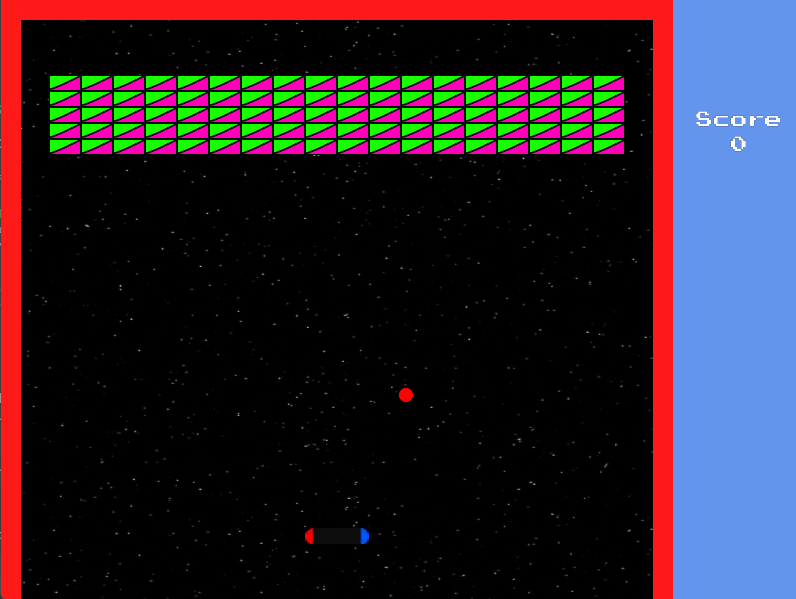

# ProgettoGraficaMasterGameDev

## Contenuto della repo

Cartella | Descrizione
------------ | -------------
[Arkanoid AG](https://github.com/Jaeger87/ProgettoGraficaMasterGameDev/tree/master/ArkanoidAG) | Il progetto visual studio dell'esame
[Arkanoid processing](https://github.com/Jaeger87/ProgettoGraficaMasterGameDev/tree/master/ArkanoidProcessing) | Prototipo in java del gioco
[Tutorial](https://github.com/Jaeger87/ProgettoGraficaMasterGameDev/tree/master/Tutorial) | Alcuni tutorial che mi sono serviti

## Feature del gioco

Ci sono due livelli, nel primo i pezzi sono tutti uguali, nel secondo invece alcune file hanno mattoncini che per essere distrutti necessitano di due colpi e quando abbattuti danno il doppio dei punti (sono colorati diversamente, quando sono colpiti la prima volta passano al colore standard).

Superato il primo livello si passa al secondo e se si supera il secondo si torna al primo livello mantenendo il punteggio. Quando si perde la pallina è game over e si ricomincia dal primo livello col punteggio azzerato.

## Comandi

Cartella | Descrizione
------------ | -------------
Frecce direzionali | muovono la racchetta
R | Quando si perde fa ricominciare la partita
N | Quando si abbattono tutti i mattoni fa cominciare il livello successivo
6 | Cheat per far partire direttamente il secondo livello